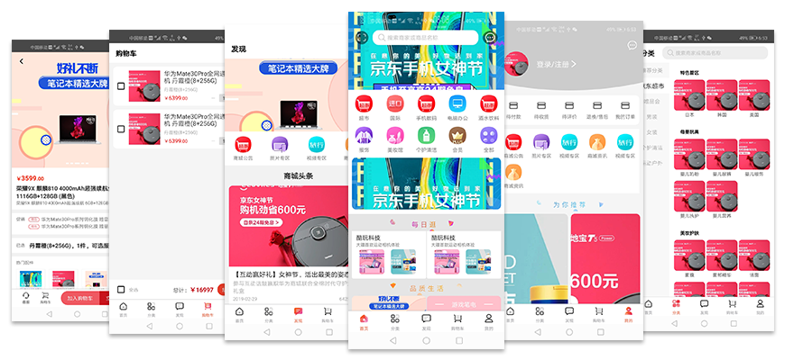

# mall_app

> ##### 技术栈：react-native(>0.6) + react-navigation(4.x) + redux
> ##### 实现效果：商城app


## 项目简介
* 基于react-native开发，
* 该项目主要包括商城首页、分类、发现、购物车、个人中心等等版块
* 封装离线缓存框架，通过校验请求时间戳缓存api接口请求数据，节省加载时间，增强用户体验
* 使用FlatList展示商品列表，封装goodsCard子类继承实现首页不同板块布局内容、推荐组件实现不同页面调用
* 封装NavigationBar实现不同页面展示的导航状态栏
* ...更多持续开发、更新中


## 主要功能

 **已实现功能** 
- [x] 商城首页
- [x] 商城分类
- [x] 商城发现
- [x] 购物车
- [x] 个人中心
- [x] 商品详情
- [x] 分类列表

 **待开发功能**
- [ ] 后台数据开发联调
- [ ] 搜索模块
- [ ] 社会化分享
- [ ] 第三方登录
- [ ] 数据统计
- [ ] 页面功能完善

            

**App图片预览**

#### 主要功能部分截图(首页、分类、发现、购物车、我的、商品详情)



## 运行

``` bash
# clone to local
git clone ...
# install dependencies
npm install

# run-android device
react-native run-android

```
## 第三方库
* redux
* react-redux
* redux-thunk
* react-navigation
* react-native-parallax-scroll-view
* react-native-vector-icons
* react-native-webview
* react-native-easy-toast
* react-native-code-push
* react-native-splash-screen


